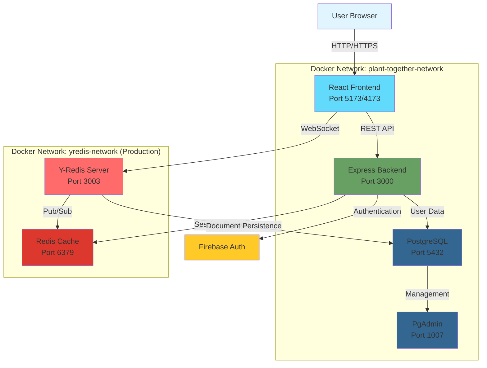

## Overview

Plant Together is built as a microservices architecture with six main components working together to provide real-time collaborative PlantUML diagram editing. The system uses Docker Compose to orchestrate these services, ensuring seamless communication and data persistence.

## Architecture Diagram



## Components

### 1. React Frontend

**Purpose**: Single-page application providing the user interface for collaborative diagram editing.

**Technology Stack**:
- React 18 with TypeScript
- Vite for build tooling
- Monaco Editor (VSCode editor for the web)
- Yjs for CRDT-based collaboration
- plantuml-core for client-side diagram rendering

**Key Features**:
- Real-time collaborative editing using Yjs
- PlantUML syntax highlighting and autocomplete
- Live diagram preview with zoom and pan
- SVG diagram export
- Offline editing with sync on reconnection
- Cross-tab communication

**Container Details**:
```yaml
Service: plant-together-react-dev
Image: Custom (built from ./react/Dockerfile.dev)
Ports: 5173 (dev), 4173 (prod)
Volumes: 
  - Source code mounted for hot reload (dev)
  - node_modules, .vite caches
```

**Communication**:
- HTTP requests to Express backend for user authentication and room management
- WebSocket connection to Y-Redis for real-time document synchronization

### 2. Express Backend

**Purpose**: REST API server handling authentication, authorization, and business logic.

**Technology Stack**:
- Node.js with Express framework
- TypeScript
- Firebase Admin SDK for authentication
- PostgreSQL client for database operations
- Redis client for session management

**Key Responsibilities**:
- User authentication and session management
- Room creation and access control
- Room signature verification for WebSocket connections
- User profile management
- API rate limiting and security

**Container Details**:
```yaml
Service: plant-together-express-dev
Image: Custom (built from ./express/Dockerfile.dev)
Ports: 3000
Dependencies: database-psql-dev
Volumes: Source code mounted (dev)
```

**API Endpoints** (examples):
- `POST /api/auth/login` - User authentication
- `POST /api/rooms` - Create new room
- `GET /api/rooms/:id` - Get room details
- `POST /api/rooms/:id/join` - Generate room access token

### 3. Y-Redis WebSocket Server

**Purpose**: Scalable WebSocket server for real-time collaborative editing using Yjs and Redis.

**Technology Stack**:
- [@y/redis](https://github.com/yjs/y-redis) - Redis-backed Yjs WebSocket provider
- uWebSockets.js for high-performance WebSocket handling
- Redis for pub/sub and message distribution
- PostgreSQL for document persistence

**Key Features**:
- CRDT-based conflict resolution using Yjs
- Horizontal scalability through Redis pub/sub
- Persistent document storage in PostgreSQL
- Automatic document cleanup
- Cross-server synchronization

**Container Details**:
```yaml
Service: plant-together-yredis-dev
Image: Custom (built from ./y-redis/Dockerfile)
Ports: 3003
Dependencies: 
  - database-psql-dev
  - redis-together-dev
```

**How It Works**:
1. Clients connect via WebSocket with a room-specific URL
2. Y-Redis loads the document from PostgreSQL (if it exists)
3. Updates are broadcast to all connected clients in real-time
4. Changes are published to Redis for cross-server distribution
5. Document state is periodically persisted to PostgreSQL

### 4. PostgreSQL Database

**Purpose**: Primary data store for persistent data including user information, room metadata, and document states.

**Technology Stack**:
- PostgreSQL 16.2
- Custom schema for user and room management

**Data Stored**:
- User profiles and authentication metadata
- Room configurations and access permissions
- Yjs document states (binary CRDT data)
- Room activity logs and metadata

**Container Details**:
```yaml
Service: database-psql-dev
Image: postgres:16.2
Ports: 5432
Volumes: pgdata-plant-together-dev (persistent storage)
Shared Memory: 128MB
```

**Connection Details**:
- Express connects for user/room data operations
- Y-Redis connects for document persistence
- PgAdmin connects for database management

### 5. Redis Cache

**Purpose**: In-memory data store for session management and Y-Redis pub/sub messaging.

**Technology Stack**:
- Redis 6.2

**Use Cases**:
- **Session Storage**: User session tokens managed by Express
- **Pub/Sub**: Real-time message distribution between Y-Redis instances
- **Rate Limiting**: API request throttling
- **Caching**: Temporary data caching for performance

**Container Details**:
```yaml
Service: redis-together-dev
Image: redis:6.2
Ports: 6379
Persistence: None (ephemeral storage)
```

**Scalability**:
Redis enables horizontal scaling of Y-Redis servers. Multiple Y-Redis instances can share document state through Redis pub/sub, allowing load balancing across servers.

### 6. PgAdmin

**Purpose**: Web-based PostgreSQL administration interface.

**Technology Stack**:
- PgAdmin 4 (version 8.4)

**Features**:
- Visual database management
- Query editor and execution
- Schema visualization
- User and permission management
- Database backup and restore

**Container Details**:
```yaml
Service: pgadmin-together-dev
Image: dpage/pgadmin4:8.4
Ports: 1007 (maps to internal port 80)
Volumes: pgadmin-together-dev (persistent storage)
Dependencies: database-psql-dev
```

**Access**:
- URL: `http://localhost:1007`
- Default credentials: `ADMIN_EMAIL` / `ADMIN_PASS` from environment variables

## Data Flow

### User Authentication Flow

<Steps>
  <Step title="User Login">
    User enters credentials in React frontend.
  </Step>
  
  <Step title="Firebase Authentication">
    React app sends credentials to Firebase Auth, receives JWT token.
  </Step>
  
  <Step title="Session Creation">
    React sends JWT to Express backend, which verifies it with Firebase Admin SDK.
  </Step>
  
  <Step title="Session Storage">
    Express creates session, stores in Redis, returns session token to client.
  </Step>
  
  <Step title="Subsequent Requests">
    Client includes session token in all API requests for authentication.
  </Step>
</Steps>

### Room Joining Flow

<Steps>
  <Step title="Room Access Request">
    User navigates to room URL in React app.
  </Step>
  
  <Step title="Room Validation">
    React requests room access from Express backend with session token.
  </Step>
  
  <Step title="Signature Generation">
    Express validates permissions, generates signed room token using `ROOM_SIGNATURE_SECRET`.
  </Step>
  
  <Step title="WebSocket Connection">
    React establishes WebSocket connection to Y-Redis with signed room token.
  </Step>
  
  <Step title="Document Loading">
    Y-Redis validates signature, loads document from PostgreSQL, sends to client.
  </Step>
</Steps>

### Collaborative Editing Flow

<Steps>
  <Step title="User Edit">
    User types in Monaco editor, creating a local Yjs update.
  </Step>
  
  <Step title="Local Apply">
    Yjs immediately applies the change locally for instant feedback.
  </Step>
  
  <Step title="Broadcast via WebSocket">
    Yjs sends the update through WebSocket to Y-Redis server.
  </Step>
  
  <Step title="Redis Pub/Sub">
    Y-Redis publishes update to Redis, distributing to all Y-Redis instances.
  </Step>
  
  <Step title="Broadcast to Clients">
    Y-Redis broadcasts update to all connected clients in the room.
  </Step>
  
  <Step title="Remote Apply">
    Other clients receive update, Yjs merges it using CRDT algorithm.
  </Step>
  
  <Step title="Persistence">
    Y-Redis periodically persists document state to PostgreSQL.
  </Step>
</Steps>

## Network Architecture

### Development Networks

Development uses a single Docker network for all services:

```yaml
networks:
  plant-together-network:
    driver: bridge
```

All containers can communicate using their service names as hostnames.

### Production Networks

Production separates services into two networks for security:

**plant-together-network**:
- React frontend
- Express backend
- PostgreSQL database
- PgAdmin

**yredis-network**:
- Y-Redis WebSocket server
- Redis cache
- (Also includes Express and React for cross-network communication)

This separation provides:
- Network isolation for sensitive services
- Flexible scaling of Y-Redis independently
- Reduced attack surface

## Scalability Considerations

### Horizontal Scaling

**Y-Redis Servers**:
Multiple Y-Redis instances can run simultaneously, sharing state through Redis pub/sub:

```bash
# Scale to 3 Y-Redis instances
docker compose up --scale plant-together-yredis=3
```

**Express Backend**:
Multiple Express instances can run behind a load balancer, sharing sessions through Redis.

### Vertical Scaling

Adjust container resources in `docker-compose.yaml`:

```yaml
services:
  database-psql-dev:
    deploy:
      resources:
        limits:
          cpus: '2'
          memory: 4G
        reservations:
          cpus: '1'
          memory: 2G
```

### Database Scaling

- **Read Replicas**: PostgreSQL can use read replicas for query distribution
- **Connection Pooling**: Use PgBouncer for efficient connection management
- **Partitioning**: Partition large tables by room or date

## Security Architecture

### Authentication & Authorization

- **Firebase Authentication**: Industry-standard OAuth 2.0 authentication
- **JWT Tokens**: Stateless authentication for API requests
- **Session Management**: Redis-backed sessions with configurable expiration
- **Room Signatures**: HMAC-signed tokens prevent unauthorized WebSocket access

### Network Security

- **Internal Networks**: Services communicate over private Docker networks
- **Port Exposure**: Only necessary ports exposed to host machine
- **TLS/SSL**: Production deployments should use HTTPS/WSS with certificates

### Data Security

- **Environment Variables**: Sensitive credentials stored outside code
- **Password Hashing**: PostgreSQL passwords should be strong and hashed
- **Secrets Management**: Use Docker secrets or external secret managers in production

## Monitoring & Observability

### Logging

Each service produces structured logs:

```bash
# View all logs
docker compose logs -f

# Filter by service
docker compose logs -f plant-together-yredis-dev
```

### Health Checks

Implement health check endpoints:

- Express: `GET /health`
- PostgreSQL: `pg_isready`
- Redis: `redis-cli ping`

### Analytics (Production)

- **PostHog**: Product analytics and feature flags
- **Microsoft Clarity**: Session recording and heatmaps

## Backup & Recovery

### Database Backups

```bash
# Backup PostgreSQL
docker exec database-psql-dev pg_dump -U postgres postgres > backup.sql

# Restore PostgreSQL
cat backup.sql | docker exec -i database-psql-dev psql -U postgres postgres
```

### Volume Backups

```bash
# Backup volume data
docker run --rm -v pgdata-plant-together-dev:/data -v $(pwd):/backup \
  ubuntu tar czf /backup/pgdata-backup.tar.gz /data
```

## Performance Optimization

### Client-Side Rendering

- **PlantUML Rendering**: Runs in browser using WebAssembly (plantuml-core)
- **Reduces Server Load**: No server-side diagram rendering needed
- **Faster Response**: Diagrams update instantly without network roundtrip

### WebSocket Efficiency

- **Binary Protocol**: Yjs uses efficient binary encoding
- **Delta Synchronization**: Only changes are transmitted, not full documents
- **Compression**: WebSocket messages can be compressed

### Database Optimization

- **Indexes**: Create indexes on frequently queried columns
- **Connection Pooling**: Reuse database connections
- **Query Optimization**: Use EXPLAIN ANALYZE for slow queries

### Caching Strategy

- **Redis Caching**: Frequently accessed data cached in Redis
- **Client-Side Caching**: Browser caches static assets
- **CDN**: Serve static assets through CDN in production

## Development vs Production

| Aspect | Development | Production |
|--------|-------------|------------|
| **Hot Reload** | Enabled (volume mounts) | Disabled (built images) |
| **Logging** | Verbose | Filtered by level |
| **Networks** | Single network | Multiple isolated networks |
| **Restart Policy** | None | `restart: always` |
| **Analytics** | Disabled | Enabled (optional) |
| **Port Exposure** | All ports exposed | Only necessary ports |
| **Resource Limits** | None | Configured limits |
| **TLS/SSL** | Optional | Required |

## Next Steps

- Set up [Docker Compose deployment](/deployment/docker-compose)
- Configure [environment variables](/deployment/environment-variables)
- Implement monitoring and alerting
- Set up automated backups
- Configure CI/CD pipeline for deployments
