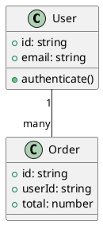

## Overview

Plant Together provides a comprehensive export system that allows you to download your diagrams in multiple formats. You can export individual documents or create a complete package containing all diagrams in a room.

## Export Formats

<CardGroup cols={3}>
  <Card title="PlantUML Code" icon="code">
    Export the raw `.puml` source code for use in other PlantUML tools or documentation.
  </Card>
  <Card title="SVG" icon="image">
    Vector graphics format that scales perfectly at any resolution. Ideal for web and print.
  </Card>
  <Card title="PNG" icon="file-image">
    Raster image format for easy sharing and embedding in presentations or documents.
  </Card>
</CardGroup>

## How to Export

<Steps>
  <Step title="Open the Download Modal">
    Click the **Download** or **Export** button in the navigation bar. This opens the download package interface.

  </Step>

  <Step title="Select Documents">
    Choose which documents you want to export:
    
    - **Check the document** to include it in the export
    - **Uncheck the document** to exclude it
    - **Click the dropdown arrow** to see format options for each document
    
    <Info>
      All documents are selected by default with all formats enabled.
    </Info>
  </Step>

  <Step title="Choose Export Formats">
    For each document, select which formats you want:
    
    <Tabs>
      <Tab title="Quick Filters">
        Use the quick filter buttons at the top to apply bulk selections:
        
        <CardGroup cols={2}>
          <Card title="All" icon="layer-group">
            Export everything: code, SVG, and PNG for all documents
          </Card>
          <Card title="Code Only" icon="code">
            Export only `.puml` source files
          </Card>
          <Card title="SVG Only" icon="image">
            Export only vector graphics
          </Card>
          <Card title="PNG Only" icon="file-image">
            Export only raster images
          </Card>
        </CardGroup>
      </Tab>
      
      <Tab title="Per-Document Selection">
        Expand each document's dropdown to customize individual formats:
        
        ```plaintext
        Document1 ▼
          ☑ Code
          ☑ SVG
          ☐ PNG
        
        Document2 ▼
          ☐ Code
          ☑ SVG
          ☑ PNG
        ```
        
        <Tip>
          Mix and match formats per document for maximum flexibility.
        </Tip>
      </Tab>
    </Tabs>
  </Step>

  <Step title="Download the Package">
    Click the **Download** button to generate and download a ZIP file containing all selected documents and formats.
    
    <Note>
      The download process may take a few seconds for rooms with many documents or when generating PNG images.
    </Note>
  </Step>
</Steps>

## Export Package Structure

The exported ZIP file is organized by document:

```plaintext
plant-uml-diagrams.zip
├── Document1/
│   ├── diagram.puml    # PlantUML source code
│   ├── diagram.svg     # Vector graphic
│   └── diagram.png     # Raster image
├── Document2/
│   ├── diagram.puml
│   └── diagram.svg
└── architecture-overview/
    ├── diagram.puml
    ├── diagram.svg
    └── diagram.png
```

<Warning>
  The ZIP filename is always `plant-uml-diagrams.zip`. Rename it after download if you need to keep multiple exports.
</Warning>

## Format Details

### PlantUML Code (.puml)

**Use cases:**
- Version control (Git)
- Import into other PlantUML tools
- Documentation repositories
- CI/CD pipeline diagram generation

**Example output:**


### SVG (Scalable Vector Graphics)

**Use cases:**
- Web documentation
- High-quality printing
- Responsive designs
- Further editing in vector tools (Figma, Illustrator)

**Advantages:**
- ✅ Infinite scaling without quality loss
- ✅ Small file size
- ✅ Searchable text
- ✅ CSS-styleable

**Technical details:**
```typescript
// Source: downloadModal.component.tsx:48-57
const convertToSVG = async (umlText: string): Promise<string> => {
  const svgResult = await plantuml.renderSvg(umlText)

  // Check if the result is an error
  if (svgResult[0] !== '<') {
    throw new Error('Failed to convert UML to SVG')
  }

  return svgResult
}
```

### PNG (Portable Network Graphics)

**Use cases:**
- PowerPoint/Keynote presentations
- Slack/Teams messages
- Email attachments
- Quick previews

**Advantages:**
- ✅ Universal compatibility
- ✅ Easy to share
- ✅ Embedded metadata

**Technical details:**
```typescript
// Source: downloadModal.component.tsx:59-69
const convertToPNG = async (umlText: string): Promise<Blob> => {
  const pngResult = await plantuml.renderPng(umlText)

  if (!pngResult.blob || pngResult.error) {
    throw new Error(
      pngResult.error?.message || 'Failed to convert UML to PNG',
    )
  }

  return pngResult.blob
}
```

## Export Process Details

### Step-by-Step Workflow

<Tabs>
  <Tab title="1. Fetch UML Content">
    The export process starts by fetching all document content from the server:
    
    ```typescript
    // Source: downloadModal.component.tsx:178
    const umlContents = await getRoomUML(roomId)
    // Returns: [{ docName: "Document1", uml: "@startuml..." }, ...]
    ```
    
    ```typescript
    // API Call - Source: plant.service.tsx:194-205
    export async function getRoomUML(
      roomId: string,
    ): Promise<{ docName: string; uml: string }[]> {
      const response = await fetch(`${serverHttpUrl}/room/${roomId}/uml`, {
        method: 'GET',
        headers: {
          Authorization: `Bearer ${await retrieveToken()}`,
        },
      })
      if (!response.ok) throw new Error('Failed to fetch UML content')
      return response.json()
    }
    ```
  </Tab>
  
  <Tab title="2. Create ZIP Archive">
    A ZIP file structure is created using JSZip:
    
    ```typescript
    // Source: downloadModal.component.tsx:179
    const zip = new JSZip()
    ```
    
    Each document gets its own folder:
    
    ```typescript
    // Source: downloadModal.component.tsx:191
    const docFolder = zip.folder(state.document.name)
    ```
  </Tab>
  
  <Tab title="3. Process Each Document">
    For each selected document, the system:
    
    ```typescript
    // Source: downloadModal.component.tsx:182-220
    for (const state of downloadStates) {
      if (!state.isSelected) continue

      const umlContent = umlContents.find(
        content => content.docName === state.document.name,
      )
      if (!umlContent) continue

      const docFolder = zip.folder(state.document.name)
      if (!docFolder) continue

      // Add code file
      if (state.code) {
        docFolder.file('diagram.puml', umlContent.uml)
      }
      
      // Convert and add SVG
      if (state.svg) {
        try {
          const svgContent = await convertToSVG(umlContent.uml)
          docFolder.file('diagram.svg', svgContent)
        } catch (error) {
          console.error(`Failed to convert ${state.document.name} to SVG`)
        }
      }
      
      // Convert and add PNG
      if (state.png) {
        try {
          const pngBlob = await convertToPNG(umlContent.uml)
          docFolder.file('diagram.png', pngBlob)
        } catch (error) {
          console.error(`Failed to convert ${state.document.name} to PNG`)
        }
      }
    }
    ```
    
    <Note>
      If conversion fails for SVG or PNG, the error is logged but the export continues with other formats.
    </Note>
  </Tab>
  
  <Tab title="4. Download ZIP">
    Finally, the ZIP is generated and downloaded:
    
    ```typescript
    // Source: downloadModal.component.tsx:223-233
    const blob = await zip.generateAsync({ type: 'blob' })
    const url = window.URL.createObjectURL(blob)

    const a = document.createElement('a')
    a.href = url
    a.download = 'plant-uml-diagrams.zip'
    document.body.appendChild(a)
    a.click()
    
    window.URL.revokeObjectURL(url)
    document.body.removeChild(a)
    ```
  </Tab>
</Tabs>

## Quick Filter Buttons

The modal provides four quick filter buttons for common export scenarios:

<CodeGroup>
```typescript All Formats
// Source: downloadModal.component.tsx:71-80
const filterAll = () => {
  setDownloadStates(prev =>
    prev.map(state => ({
      ...state,
      isSelected: true,
      code: true,
      svg: true,
      png: true,
    })),
  )
}
```

```typescript Code Only
// Source: downloadModal.component.tsx:83-92
const filterCode = () => {
  setDownloadStates(prev =>
    prev.map(state => ({
      ...state,
      isSelected: true,
      code: true,
      svg: false,
      png: false,
    })),
  )
}
```

```typescript SVG Only
// Source: downloadModal.component.tsx:95-104
const filterSvg = () => {
  setDownloadStates(prev =>
    prev.map(state => ({
      ...state,
      isSelected: true,
      code: false,
      svg: true,
      png: false,
    })),
  )
}
```

```typescript PNG Only
// Source: downloadModal.component.tsx:107-116
const filterPng = () => {
  setDownloadStates(prev =>
    prev.map(state => ({
      ...state,
      isSelected: true,
      code: false,
      svg: false,
      png: true,
    })),
  )
}
```
</CodeGroup>

## Selection Logic

The export modal implements intelligent selection logic:

### Document-Level Selection

```typescript
// Source: downloadModal.component.tsx:119-133
const handleDocumentCheck = (docId: number, checked: boolean) => {
  setDownloadStates((prev) =>
    prev.map((state) =>
      state.document.id === docId
        ? {
            ...state,
            isSelected: checked,
            code: checked,    // When doc is checked, enable all formats
            svg: checked,
            png: checked,
          }
        : state,
    ),
  )
}
```

### Format-Level Selection

```typescript
// Source: downloadModal.component.tsx:135-160
const handleTypeCheck = (
  docId: number,
  type: 'code' | 'svg' | 'png',
  checked: boolean,
) => {
  setDownloadStates((prev) =>
    prev.map((state) => {
      if (state.document.id === docId) {
        const newState = { ...state, [type]: checked }
        
        // If all formats unchecked, uncheck parent document
        if (!newState.code && !newState.svg && !newState.png) {
          newState.isSelected = false
        }
        
        // If any format checked, check parent document
        if (newState.code || newState.svg || newState.png) {
          newState.isSelected = true
        }
        
        return newState
      }
      return state
    }),
  )
}
```

<Info>
  This logic ensures consistency: you can't have a document selected with no formats, and you can't have formats selected without the document being checked.
</Info>

## Best Practices

<AccordionGroup>
  <Accordion title="Choose the Right Format" icon="check">
    **For documentation:**
    - Use **SVG** for web docs (Markdown, MDX, HTML)
    - Use **PNG** for static site generators
    - Keep **code** in version control
    
    **For presentations:**
    - Use **PNG** for PowerPoint/Keynote
    - Use **SVG** for web-based presentations (reveal.js)
    
    **For sharing:**
    - Use **PNG** for chat/email
    - Use **code** for developer collaboration
  </Accordion>

  <Accordion title="Export Regularly" icon="clock">
    Create backups of important diagrams:
    
    - Export after major milestone completions
    - Keep versioned exports in your project repository
    - Export before making significant changes
    - Consider automating exports via the API
  </Accordion>

  <Accordion title="Optimize File Sizes" icon="gauge">
    **SVG files:**
    - Already optimized by PlantUML
    - Can be further compressed with SVGO if needed
    
    **PNG files:**
    - Use PNG for photographs/complex gradients
    - Prefer SVG for simple diagrams (smaller file size)
    - Consider PNG compression tools for large batches
  </Accordion>

  <Accordion title="Organize Your Exports" icon="folder">
    Maintain a clear export structure:
    
    ```plaintext
    project/
    ├── docs/
    │   └── diagrams/
    │       ├── 2024-03-01-architecture.zip
    │       └── 2024-03-15-api-design.zip
    └── source/
        └── plantuml/
            ├── architecture.puml
            └── api-design.puml
    ```
  </Accordion>
</AccordionGroup>

## Troubleshooting

<AccordionGroup>
  <Accordion title="Download Button Disabled">
    **Causes:**
    - No documents selected
    - Export is currently processing
    
    **Solution:**
    - Ensure at least one document is checked
    - Wait for the current export to complete
  </Accordion>

  <Accordion title="SVG Conversion Failed">
    **Possible causes:**
    - Syntax errors in PlantUML code
    - Unsupported PlantUML features
    - Server rendering timeout
    
    **Solutions:**
    1. Check the diagram renders correctly in the preview
    2. Fix any PlantUML syntax errors
    3. Try exporting individual documents instead of bulk
    4. Contact support if the issue persists
  </Accordion>

  <Accordion title="PNG Conversion Failed">
    **Possible causes:**
    - Very large/complex diagram
    - Browser memory limitations
    - CheerpJ rendering issues
    
    **Solutions:**
    1. Try SVG export instead (usually more reliable)
    2. Simplify the diagram if possible
    3. Close other browser tabs to free memory
    4. Refresh the page and try again
  </Accordion>

  <Accordion title="ZIP File Is Empty or Corrupt">
    **Possible causes:**
    - Browser interrupted the download
    - Insufficient storage space
    - Popup blocker preventing download
    
    **Solutions:**
    1. Check browser download settings
    2. Ensure sufficient disk space
    3. Disable popup blockers for Plant Together
    4. Try a different browser
  </Accordion>

  <Accordion title="Export Takes Too Long">
    **Causes:**
    - Large number of documents
    - Multiple PNG conversions (slow)
    - Server under heavy load
    
    **Solutions:**
    1. Export fewer documents at once
    2. Use SVG instead of PNG when possible
    3. Try during off-peak hours
    4. Use format filters to reduce processing
  </Accordion>
</AccordionGroup>

## Programmatic Export

You can automate exports using the Plant Together API:

<CodeGroup>
```typescript Fetch UML Content
import { getRoomUML } from './plant.service'

const exportRoomContent = async (roomId: string) => {
  const documents = await getRoomUML(roomId)
  
  documents.forEach(({ docName, uml }) => {
    console.log(`Document: ${docName}`)
    console.log(uml)
  })
}
```

```bash cURL Example
# Fetch all UML content from a room
curl -X GET "https://planttogether.com/api/room/{roomId}/uml" \
  -H "Authorization: Bearer YOUR_JWT_TOKEN"
```

```javascript Node.js Example
const fetch = require('node-fetch')
const JSZip = require('jszip')
const fs = require('fs')

async function exportRoom(roomId, authToken) {
  // Fetch UML content
  const response = await fetch(
    `https://planttogether.com/api/room/${roomId}/uml`,
    {
      headers: { Authorization: `Bearer ${authToken}` }
    }
  )
  
  const documents = await response.json()
  
  // Create ZIP
  const zip = new JSZip()
  
  documents.forEach(({ docName, uml }) => {
    const folder = zip.folder(docName)
    folder.file('diagram.puml', uml)
  })
  
  // Save to file
  const content = await zip.generateAsync({ type: 'nodebuffer' })
  fs.writeFileSync('export.zip', content)
}
```
</CodeGroup>

## Next Steps

<CardGroup cols={2}>
  <Card title="Integrate Diagrams" icon="code" href="/api/documents/get-uml">
    Use the API to integrate exports into your workflow
  </Card>
  <Card title="Collaboration Guide" icon="users" href="/guides/collaboration">
    Learn how to work with teams on diagrams
  </Card>
  <Card title="Private Rooms" icon="lock" href="/guides/private-rooms">
    Secure your diagrams with private room access
  </Card>
  <Card title="PlantUML Documentation" icon="book" href="https://plantuml.com/">
    Learn more about PlantUML syntax and features
  </Card>
</CardGroup>
