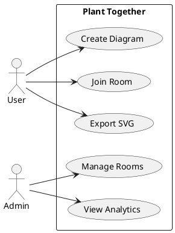
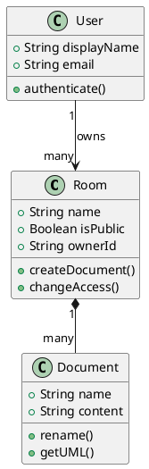
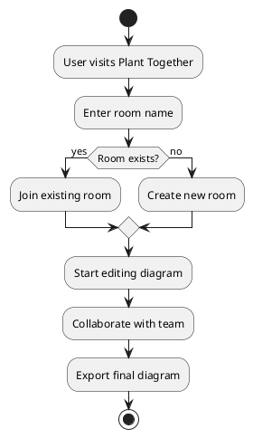

## Create Your First Collaborative Diagram

This guide will walk you through creating your first PlantUML diagram with Plant Together. You'll be collaborating in real-time within minutes.

<Note>
  No installation required! Plant Together runs entirely in your browser.
</Note>

<Steps>
  <Step title="Visit Plant Together">
    Navigate to [plant-together.nnourr.tech](https://plant-together.nnourr.tech/) in your web browser.
    
    You can use any modern browser - Chrome, Firefox, Safari, or Edge all work great.
  </Step>

  <Step title="Create or Join a Room">
    When you arrive, you'll see the option to create a new room or join an existing one.

    **To create a new room:**
    - Enter a unique room name (e.g., "my-team-diagram")
    - Choose whether to make it public or private
    - Click **Create Room**

    **To join an existing room:**
    - Enter the room name shared by your collaborator
    - Click **Join Room**

    <Warning>
      Room names are currently shared globally. Use unique, specific names to avoid accidentally joining someone else's room.
    </Warning>
  </Step>

  <Step title="Set Your Display Name">
    Choose a display name so your collaborators know who's editing.
    
    You can continue as a guest or sign up for an account to access your rooms persistently across sessions.
  </Step>

  <Step title="Start Creating Your Diagram">
    Once inside the room, you'll see two panels:
    - **Left panel**: Monaco code editor for your PlantUML code
    - **Right panel**: Live preview of your diagram

    Try entering this simple sequence diagram:

    ```plantuml
    @startuml
    Alice -> Bob: Hello Bob!
    Bob --> Alice: Hello Alice!
    @enduml
    ```

    Watch as the diagram renders in real-time on the right panel!
  </Step>

  <Step title="Invite Collaborators">
    Share your room with others so they can collaborate:

    1. Copy the room URL from your browser's address bar
    2. Send it to your team members via email, Slack, or your preferred communication tool
    3. They can click the link and join immediately

    <Info>
      All collaborators will see changes in real-time as each person types. No need to refresh or save manually!
    </Info>
  </Step>

  <Step title="Interact with Your Diagram">
    The diagram preview panel supports several interactions:

    - **Zoom**: Use your mouse wheel or pinch gesture to zoom in and out
    - **Pan**: Click and drag to move around the diagram
    - **Export**: Click the export button to download your diagram as an SVG file

    <Tip>
      SVG exports are vector-based, so they'll look crisp at any size in your documentation!
    </Tip>
  </Step>
</Steps>

## Example Diagrams to Try

Once you're comfortable with the basics, try creating these common diagram types:

<CodeGroup>





</CodeGroup>

## Offline Editing

Plant Together automatically handles connection interruptions:

- If you lose internet connection, continue editing normally
- Your changes are stored locally in your browser
- When you reconnect, all changes automatically sync with the server
- Cross-tab communication works even when the central server is down

<Check>
  Your work is never lost! Plant Together's offline sync ensures continuity even with unstable connections.
</Check>

## Next Steps

Now that you've created your first collaborative diagram, explore more features:

<CardGroup cols={2}>
  <Card
    title="Creating Rooms"
    icon="door-open"
    href="/guides/creating-rooms"
  >
    Learn about room types, naming, and access control
  </Card>
  <Card
    title="Collaboration Features"
    icon="users"
    href="/guides/collaboration"
  >
    Discover advanced collaboration capabilities
  </Card>
  <Card
    title="Exporting Diagrams"
    icon="file-export"
    href="/guides/exporting-diagrams"
  >
    Export your diagrams in various formats
  </Card>
  <Card
    title="Private Rooms"
    icon="shield"
    href="/guides/private-rooms"
  >
    Set up secure, private collaboration spaces
  </Card>
</CardGroup>

## Need Help?

If you run into any issues:

- Check the [PlantUML documentation](https://plantuml.com/) for diagram syntax
- Review our [Guides](/guides/creating-rooms) for detailed feature explanations
- Explore the [API Reference](/api/auth/signup) if you're building integrations

<Info>
  Plant Together uses the standard PlantUML syntax, so any PlantUML diagram you've created elsewhere will work here!
</Info>